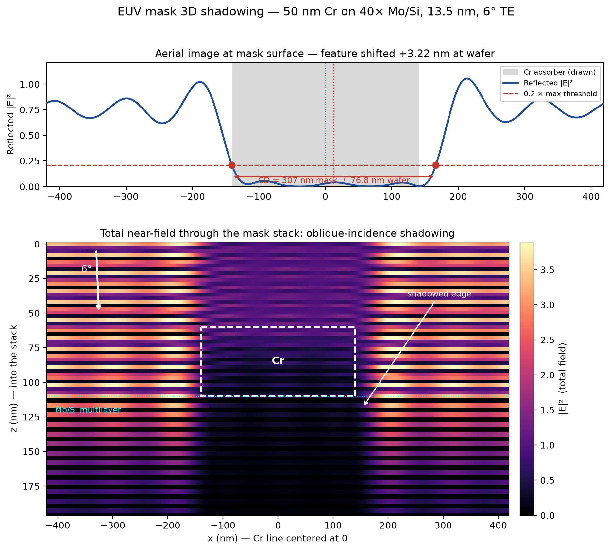

# Differentiable RCWA for EUV Mask Metrology

A differentiable electromagnetic pipeline for EUV photomask metrology at 13.5 nm,
built on [fmmax](https://github.com/facebookresearch/fmmax) (JAX). The forward
model computes reflectance from a patterned absorber on a 40-bilayer Mo/Si
multilayer; reverse-mode autodiff through the solver gives exact parameter
gradients, enabling gradient-based inverse metrology and a quantitative
identifiability analysis: **which mask parameters can a reflectance measurement
actually recover, and with what confidence?**



## Key results (preliminary — see status below)

- **Identifiability split.** From a single-angle TE wavelength scan
  (13.0–14.0 nm, 15 points, 0.5% noise), absorber and ARC thickness recover to
  ~±1.5 nm — but CD and sidewall angle are mutually degenerate (~±37 nm, ~±33°;
  Jacobian condition number ~2.4×10³). The near-null singular vector is
  (CD +0.76, sidewall −0.65): a narrower vertical line and a wider sloped line
  produce nearly identical spectra.
- **Loss landscape.** The fitting landscape is multimodal with period set by
  λ/2n ≈ 7.3 nm of interference in the absorber. The global minimum sits at the
  noise floor, ~100× deeper than local minima, but its capture radius is under
  2 nm — a quantitative argument for library search before local refinement, as
  production OCD does.
- **Mask 3D shadowing.** At 6° chief-ray incidence, a 280 nm (mask-scale) Cr
  line prints wide and shifted; the shift scales as tanθ across 0–10°, is
  exactly zero at normal incidence (symmetry check), and grows with absorber
  thickness (2.3 → 3.9 nm at wafer over 20–100 nm Cr), consistent with
  Schiavone et al. (2001).

## What's in here

| Notebook | Purpose |
|---|---|
| `01_multilayer_benchmark.ipynb` | Validation. Planar Mo/Si stacks via TMM: 74.3% ideal peak at 13.5 nm (FWHM 0.62 nm), bilayer-count convergence, absorber-contrast curves vs. Schiavone (2001) Fig. 2. |
| `02_mask_3d_shadowing.ipynb` | Forward problem. Patterned absorber on the multilayer via RCWA (fmmax): near-field maps, line width/shift extraction, angle and thickness sweeps, modern TaBN + Ru-cap stack. |
| `03_inverse_reflectometry.ipynb` | Inverse problem. Differentiable geometry (sigmoid edges, sliced-trapezoid sidewall), gradient verification vs. finite differences (<0.4%, O(h²)), Jacobian SVD / identifiability, CRB-style uncertainties, gradient-descent fitting and loss-landscape analysis. |

Optical constants in `data/cxro/` are from the CXRO/Henke database
(B.L. Henke, E.M. Gullikson, J.C. Davis, *At. Data Nucl. Data Tables* 54,
181–342, 1993), via https://henke.lbl.gov/optical_constants/.

## Validation

The solver is checked three ways: TMM agreement for the unpatterned stack;
reproduction of published absorber-contrast and line-shift results
(Schiavone et al., *Proc. SPIE* 2001) for the patterned case; and reverse-mode
gradients matching central finite differences to <0.4% with clean O(h²)
step-size convergence.

## Status / known limitations (actively being addressed)

- Numbers above are from single-precision (complex64) runs with plain Laurent
  (FFT) factorization; **migration to float64 + Li-rule (vector) factorization
  is in progress** — headline digits may shift, the degeneracy structure should
  not. TE only so far; TM is being added, which may partially lift the
  CD/sidewall degeneracy.
- Truncation-convergence error bars for the shadowing metrics are being added.
- Reported uncertainties are local (linearized/CRB); the multimodal landscape
  means global uncertainty is at least as large.

## Running

```bash
pip install -r requirements.txt
jupyter lab
```

Run notebooks from the repository root (paths are relative to it).

## Author

Yeshudan Bora — MS, Artificial Intelligence Engineering (ChemE), Carnegie
Mellon University, Dec 2026. ybora@andrew.cmu.edu ·
[Google Scholar](https://scholar.google.com) · [LinkedIn](https://linkedin.com/in/yeshudanbora)
